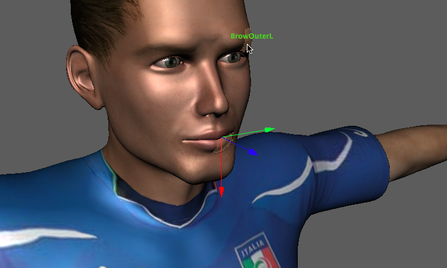

Mannequin
==========


Mannequin is a plugin for Maya that allows you to animate a character rig
by interacting directly with the character mesh. Simply hover over the mesh,
and Mannequin will detect and highlight parts of the mesh corresponding to
different bones in the rig.

Mannequin also includes a convenient side panel that gives you quick access
to all the joints in your rig and allows you to search through them.


Installation
------------
The plugin has been tested on **Maya 2015 SP4** and **Maya 2016** using Mac OS X
and Windows. It will not work on versions of Maya before 2015 SP4.

If you are on Mac OS X or Windows, there are pre-built binaries available from
the [Releases](https://github.com/sdao/mannnequin/releases) page on GitHub. If
you are on Linux, you will have to compile the plugin from source (see the
*Building* section below for some more information).

To install:

1. Copy the `mannequin_module` folder to your computer. You can put it
anywhere that you'd like, but please note the location of the `mannequin_module`
folder.

2. You should then open `mannequin.mod` in a text editor and edit it so that it
points to your `mannequin_module.` For example, if I relocated the
`mannequin_module` folder to `/Users/Steve`, I would edit `mannequin.mod` to be:
  ```
  + Mannequin 0.25 /Users/Steve/mannequin_module
  ```

3. Finally, you need to drop the `mannequin.mod` file into one of Maya's module
search directories. You can see these directories by executing the MEL command
`getenv MAYA_MODULE_PATH` in your Maya command line. Possible locations include:
  * Mac: `/Users/Shared/Autodesk/modules/maya/mannequin.mod`
  * Windows: `%USERPROFILE%\Documents\maya\modules\mannequin.mod`


Usage
-----
Mannequin will install a "Mannequin" shelf in Maya if one doesn't exist. For
best results, hide the joints in your rig before continuing. Select the
smooth-bound mesh and click the 
Mannequin icon to begin. Mannequin doesn't work with NURBS surfaces, only poly
meshes. However, it does work with poly meshes that have nodes such as the
Smooth node applied.


Screenshots
-----------


In this image, the lower lip has an active translation manipulator. The pointer is hovered over the outer-left eyebrow, which highlights it in the viewport.


Mannequin also has a panel containing an editor for each joint in the rig. By
typing in the search bar at the top, you can filter the joints.

Rotation channels appear in blue groups, and translation channels appear in
green groups. A yellow border indicates the currently-selected joint. Fields
with red backgrounds indicate a keyframe, just like in the Channel Box.


Building
--------
You will need [Boost](http://www.boost.org/) installed. Mac users can install
Boost from [Homebrew](http://brew.sh) with the command `brew install boost`.
Windows users can install Boost using NuGet; the included VS project should
automatically retrieve the Boost package. Linux users can install Boost from
the system package manager.

### Make (Mac OS X and Linux)
The Makefile included is copied from a Mac OS X installation of Maya 2016. If
you are compiling on Linux, you will need to use the Makefile from a Linux
installation of Maya. If you are compiling for Maya 2015, you will need to edit
the `TOP` variable in the Makefile to point to Maya 2015's SDK.

Run `make` to compile the plugin `mannequin.bundle` and build the Maya module
`mannequin_module`.

### Visual Studio (Windows)
The Visual Studio project included must be compiled using Visual Studio 2012
Update 4. By default it will compile using the Maya 2016 SDK. If you need to
compile for Maya 2015:

1. Go to **View > Property Manager**.
2. Open the **MannequinWindowsMaya** property sheet under any configuration.
3. Go to the **User Macros** page.
4. Edit the `MayaRoot` macro to point at Maya 2015's SDK instead.

### Autodesk documentation links
* [Building plugins](http://help.autodesk.com/cloudhelp/2016/ENU/Maya-SDK/files/Setting_up_your_build_environment.htm)
* [Maya modules](http://help.autodesk.com/cloudhelp/2016/ENU/Maya-SDK/files/GUID-130A3F57-2A5D-4E56-B066-6B86F68EEA22.htm)
